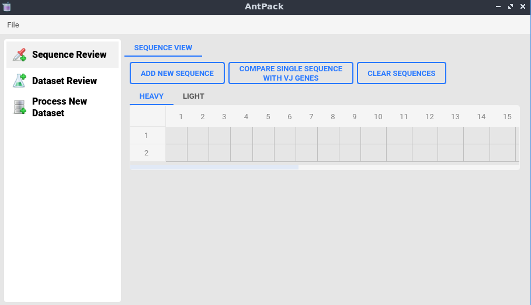
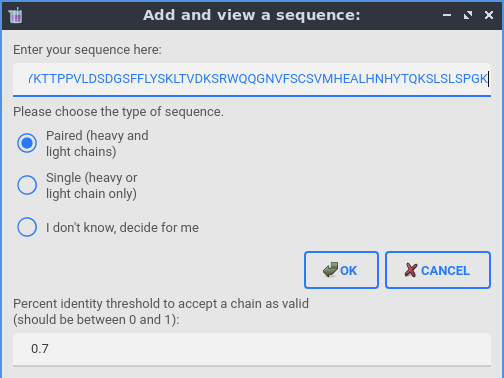
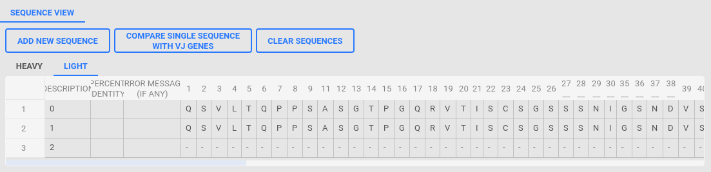
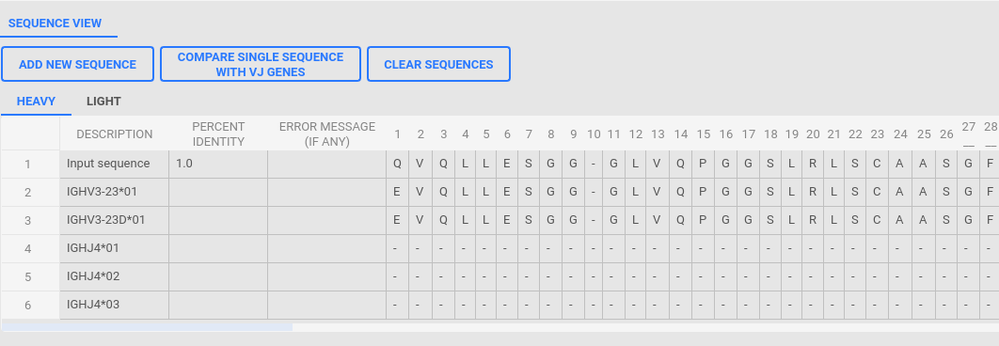

Using the GUI: A tutorial
=====================================

Starting in v0.3.7, you can launch a GUI tool that provides some
basic capabilities for a small number of sequences (we plan to
extensively expand this tool in future versions).

To run the GUI, you must have two additional dependencies,
``pyside6`` and ``qt_material`` installed. Next, from the command
line, type:::

  AntPack-GUI

This is in contrast to:::

  AntPack-CLI

which runs the command line interface. You should see the following screen:

Note that at this point, only the "Sequence Review" is implemented (more to
come later). You can select a numbering scheme using the file menu, then
you can either view a single sequence together with the closest corresponding
VJ / germline genes from humans or mice, or you can add and view as many
sequences as you want and see how they compare.

For example, we can add a sequence by clicking on add sequence then pasting
it into the appropriate blank and selecting appropriate options:

for more about some of these options, see the AntPack numbering tutorials. You
can view a mixture of single and paired chain sequences as illustrated below --
the sequences with only one chain will show up as heavy or light only under
the appropriate view. Notice that CDRs for your currently selected numbering
scheme are marked using "_".

You can also compare a single paired or single chain sequence with the closest VJ /
germline sequences from human or mouse as illustrated. This feature is currently
supported only if the IMGT numbering scheme is selected and uses assignment by
percent identity only at present. If multiple V/J genes have the same percent
identity to the input, all will be shown.

Notice that the GUI (at present) is not so powerful or flexible as the Python API
and offers fewer options; currently, it's best suited for quickly comparing a
handful of sequences. If you want to do a standard analysis on a much larger
group of sequences, you may prefer the command line interface, and if you
want a more powerful and flexible tool to design your own workflows the Python
API is likely preferable.
