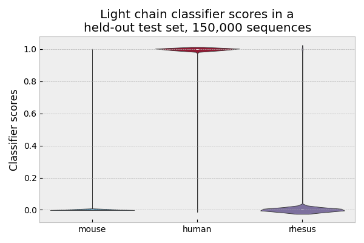
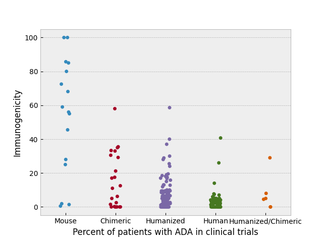
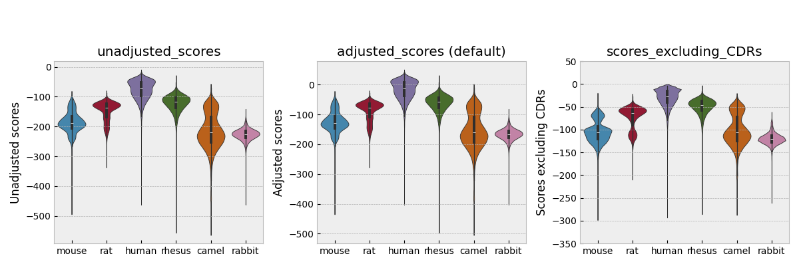
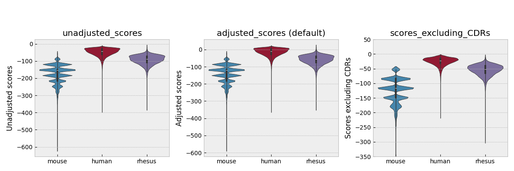

How humanness evaluation in AntPack works
===============================================

Once antibodies have been numbered, they form fixed-length
sequences as part of a multiple sequence alignment. The
probability of any given sequence can be estimated using
very simple generative models fitted to large antibody
sequence datasets. This simple model is a distribution across
sequence space that consists of *M* clusters, so we can use it
to score sequences, generate new sequences that contain a desired
motif, or suggest modifications to an existing sequence that would
make it more similar to one of the clusters in the model.

Remarkably, when it comes to distinguishing
human from nonhuman sequences, simple models in this case
(e.g. our model or the k-mer based model in BioPhi)
match or outperform more "sophisticated" models, e.g.
currently available antibody LLMs and random forest
classifiers. For some benchmarking of simple mixture models
vs a variety of other options described in the literature,
see `Parkinson et al. 2024 <https://www.biorxiv.org/content/10.1101/2024.01.27.577555v3.abstract>`_

The humanness scoring tool in AntPack doesn't have to be used
in conjunction with AntPack numbering, and AntPack numbering
can be used independently of the scoring tool. The humanness
scoring model was however trained using AntPack numbering so
it's probably easiest to use this in general.

When you score a sequence for humanness using AntPack, the
library 1) numbers the sequence using IMGT numbering and 2)
calculates the log-probability of this sequence given its
original training set (60 million heavy chains and 70 million
light). AntPack can then subtract the median scores from the
training set so that heavy / light chain scores are on the
same scale (or not, if you turn this setting off). Higher
scores indicate a more human sequence.

It's also possible to score the sequence while 1) masking CDR3,
2) excluding N- or C-terminal deletions, 3) excluding all gaps,
or 4) masking a custom region you'd like to exclude.
This way, if you want to see what the score looks like while
excluding a deletion or if you just want to see the score for
a specific region you can do that as well.

AntPack can be run in classifier mode, where it classifies
a sequence as one of rhesus monkey, mouse, human or (for heavy chain)
rat. On held-out test sets, this procedure achieves accuracy > 99.9%.
See light chain below for example (heavy chain is similar):

However, we don't recommend using AntPack in classifier mode because
like other classifiers in the literature (e.g. Hu-mAb), it fails on
sequences from species not included in the training set (e.g. rabbit,
camel). Also, species classification is less granular since it doesn't
take into account greater similarities between sequences from some
species (e.g. rhesus monkey vs human).

AntPack can humanize a sequence by suggesting modifications that
can improve the score. Finally, you can use AntPack as a generative
model to generate new human antibody sequences by retrieving the
model cluster that's most similar to a sequence of interest and then
sampling from this model cluster.

What is a good humanness score? or, how human do I need to be?
---------------------------------------------------------------

Unfortunately there's no fixed answer to this question, because
immunogenicity is a complex phenomenon that is not a simple
function of humanness. There are some sequences of
mouse origin that are not immunogenic in humans, and some rare
sequences of human origin that form ADA in some patients. However,
the more human a sequence, the lower the *risk* of immunogenicity in
*general*. Hence, we can say *roughly* what constitutes an acceptable
humanness score based on the 400 million heavy and light sequences we
used for initial testing.

Here's data from Marks et al. on the percentage of patients
developing anti-drug antibodies (ADA) to 217 antibody drugs
in clinical trials. The antibodies are grouped by species of
origin (e.g. mouse antibody, humanized or chimeric mouse antibody,
human antibody, etc.). It's immediately apparent that human antibodies
have the lowest risk of severe immunogenicity, followed by
humanized antibodies, followed by chimeric, with mouse of course the
worst of all.

Here are the score distributions using AntPack for 450,000 held-out
heavy and light sequences from various species of origin, using either adjusted
score (the default), unadjusted score, or with CDRs excluded. Behavior
on larger test sets is similar. You
can use this as a rough guide to what's "human" and what's not. Rhesus
monkeys are of course more similar to humans genetically and antibodies
of rhesus monkey origin tend to score more highly. When scoring an antibody,
we average over the heavy and light chain scores.

See `Parkinson et al. 2024 <https://www.biorxiv.org/content/10.1101/2024.01.27.577555v3.abstract>`_
to see what score distributions look like for specific sub-regions
of heavy and light chains, or for more details on the distributions shown
above.

Notice that heavy and light chain scores have different distributions,
so that combining them to form a single score for a whole antibody
by just averaging them can be problematic. If you want a single
score for the whole antibody, it's best to normalize the scores
for the two chains and then average them. Likewise, if you're
just scoring specific regions (e.g. framework 1, CDR2 etc.) and
want to compare scores across different regions, normalization
can be useful.
